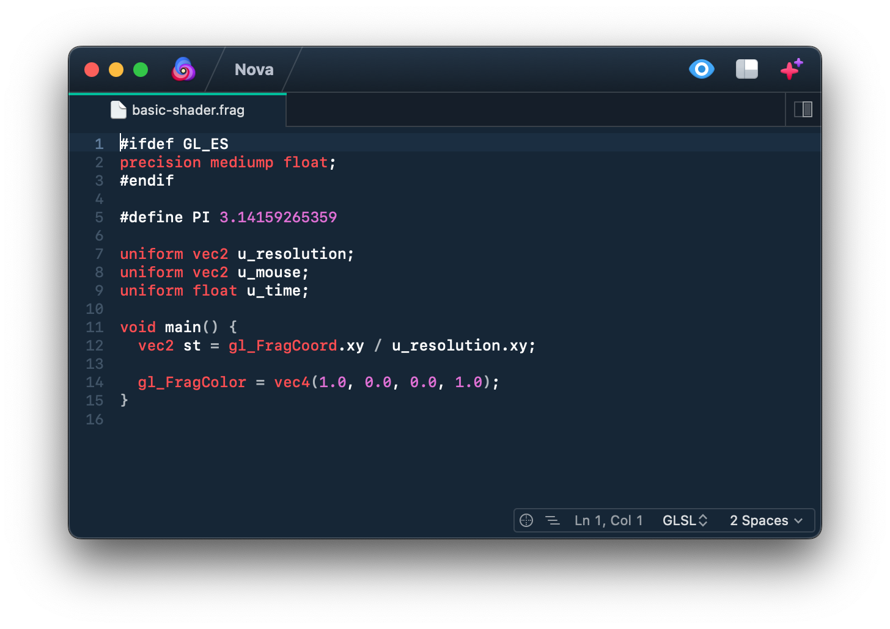

**GLSL** provides syntax highlighting for **The OpenGL® Shading Language**.

## Language Support

GLSL currently supports the following file extensions of The OpenGL® Shading Language:

- `.glsl`
- `.frag`
- `.vert`
